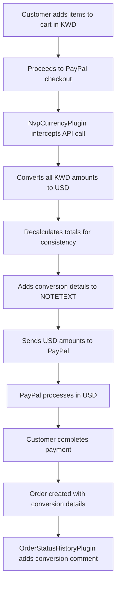

# Logicrays PaypalUsd Module

## Overview

The **Logicrays_PaypalUsd** module enables PayPal Express Checkout to work seamlessly with Kuwaiti Dinar (KWD) currency in Magento 2. Since PayPal doesn't natively support KWD, this module automatically converts KWD amounts to USD before sending them to PayPal, while maintaining KWD as the store's base and display currency.

## 🎯 Key Features

- ✅ **Seamless KWD Support**: Keep your store in KWD while using PayPal
- ✅ **Automatic Currency Conversion**: Real-time KWD → USD conversion using Magento's currency rates
- ✅ **PayPal Visibility Fix**: Makes PayPal Express available even with KWD base currency
- ✅ **Transaction Integrity**: Ensures PayPal API calls have consistent totals
- ✅ **Comprehensive Logging**: Detailed conversion tracking in PayPal requests
- ✅ **Order History**: Automatic conversion details in order comments
- ✅ **Refund Support**: Transaction IDs tracked for online refunds
- ✅ **Error Resilience**: Robust error handling prevents checkout interruption

## 🔧 Technical Architecture

### Core Components

| Component | Purpose |
|-----------|---------|
| `NvpCurrencyPlugin` | Intercepts PayPal NVP API calls and handles currency conversion |
| `OrderStatusHistoryPlugin` | Adds conversion details to order history |
| `Config` | Ensures PayPal visibility with KWD currency |

### Plugin System

The module uses Magento 2's plugin system to intercept and modify:
- **PayPal NVP API calls** (`Magento\Paypal\Model\Api\Nvp::call`)
- **Order status history** (`Magento\Sales\Model\Order::addStatusHistory`)
- **PayPal configuration** (`Magento\Paypal\Model\Config`)

## 📋 Requirements

- **Magento Version**: 2.4.x
- **PHP Version**: 8.1+
- **PayPal Account**: Business account with NVP/SOAP API credentials
- **Currency Setup**: KWD configured as base/display currency with USD exchange rate
- **SSL Certificate**: Required for PayPal transactions

## 🚀 Installation

### Method 1: Manual Installation

1. **Download/Clone** the module to your Magento installation:
   ```bash
   mkdir -p app/code/Logicrays/PaypalUsd
   # Copy module files to the directory
   ```

2. **Enable the module**:
   ```bash
   php bin/magento module:enable Logicrays_PaypalUsd
   php bin/magento setup:upgrade
   php bin/magento setup:di:compile
   php bin/magento cache:clean
   ```

### Method 2: Composer (if packaged)

```bash
composer require logicrays/magento2-paypal-usd
php bin/magento module:enable Logicrays_PaypalUsd
php bin/magento setup:upgrade
php bin/magento setup:di:compile
php bin/magento cache:clean
```

## ⚙️ Configuration

### 1. Currency Configuration

**Admin Panel → Stores → Configuration → General → Currency Setup**

- **Base Currency**: KWD (Kuwaiti Dinar)
- **Default Display Currency**: KWD
- **Allowed Currencies**: KWD, USD

### 2. Exchange Rate Setup

**Admin Panel → Stores → Currency → Currency Rates**

- Set up **KWD → USD** exchange rate
- **Example**: 1 KWD = 3.27 USD (adjust based on current rates)
- Enable automatic rate updates if needed

### 3. PayPal Configuration

**Admin Panel → Stores → Configuration → Sales → Payment Methods → PayPal Express Checkout**

#### Basic Settings
- **Enable**: Yes
- **Title**: PayPal Express Checkout
- **Payment Action**: 
  - `Sale` - for immediate capture
  - `Authorization` - for manual capture (recommended for order management)

#### API Credentials
- **API Username**: Your PayPal API username
- **API Password**: Your PayPal API password  
- **API Signature**: Your PayPal API signature
- **Sandbox Mode**: Enable for testing

#### Advanced Settings
- **Payment Applicable From**: All Allowed Countries
- **Debug**: Enable for troubleshooting
- **Enable In-Context Checkout**: Disable (recommended to avoid popup issues)

## 🔄 How It Works

### Currency Conversion Flow



### API Interception Process

1. **Detection**: Plugin detects PayPal NVP API calls
2. **Currency Check**: Identifies KWD amounts in request
3. **Conversion**: Converts using Magento's currency rate (KWD → USD)
4. **Recalculation**: Ensures total consistency:
   ```
   AMT = ITEMAMT + TAXAMT + SHIPPINGAMT + HANDLINGAMT + INSURANCEAMT - SHIPDISCAMT
   ```
5. **Mirroring**: Copies values to `PAYMENTREQUEST_0_*` fields
6. **Documentation**: Adds conversion details to `NOTETEXT`
7. **Transmission**: Sends modified request to PayPal

### Supported API Methods

- ✅ `SetExpressCheckout` - Initial payment setup
- ✅ `DoExpressCheckoutPayment` - Payment processing  
- ✅ `DoCapture` - Authorization capture
- ✅ `RefundTransaction` - Payment refunds
- ⚠️ `GetExpressCheckoutDetails` - Currency codes only (no amount conversion)

## 💰 Conversion Examples

### Example 1: Simple Product Purchase
```
Original (KWD):
- Product: KWD 10.00
- Tax: KWD 0.50  
- Total: KWD 10.50

Converted (USD @ 1 KWD = 3.27 USD):
- Product: USD 32.70
- Tax: USD 1.64
- Total: USD 34.34
```

### Example 2: Complex Order with Shipping
```
Original (KWD):
- Items: KWD 25.00
- Shipping: KWD 5.00
- Tax: KWD 2.40
- Total: KWD 32.40

Converted (USD):
- Items: USD 81.75
- Shipping: USD 16.35  
- Tax: USD 7.85
- Total: USD 105.95
```

## 📝 Order Comments

The module automatically adds detailed conversion information to order history:

```
KWD→USD conversion applied via Logicrays_PaypalUsd module. 
Original amounts in KWD, sent to PayPal in USD. 
AMT: KWD 32.40 → USD 105.95. 
SHIPPINGAMT: KWD 5.00 → USD 16.35. 
ITEMAMT: KWD 25.00 → USD 81.75. 
TAXAMT: KWD 2.40 → USD 7.85. 
PayPal Transaction ID: 4R171711MX5801425
```

## 🛠️ Troubleshooting

### Common Issues & Solutions

#### 1. PayPal Error 10413: "Totals mismatch"
**Cause**: Item totals don't match order total
**Solution**: Module automatically recalculates totals - ensure latest version is installed

#### 2. PayPal Error 10415: "Token already used"
**Cause**: Attempting to reuse a PayPal token
**Solution**: 
- Set Payment Action to "Authorization"
- Use "Capture Online" for invoicing
- Use "Refund Online" for credit memos

#### 3. PayPal popup closes automatically
**Cause**: Browser/cookie issues with in-context checkout
**Solution**:
- Disable "Enable In-Context Checkout" in PayPal settings
- Ensure HTTPS is properly configured
- Clear browser cache and cookies

#### 4. Missing order comments
**Cause**: Plugin execution issues
**Solution**: 
- Check module is enabled: `php bin/magento module:status Logicrays_PaypalUsd`
- Recompile: `php bin/magento setup:di:compile`
- Clear cache: `php bin/magento cache:clean`

#### 5. Online refund not available
**Cause**: No capture transaction ID
**Solution**:
- Ensure payment was captured (not just authorized)
- Use "Capture Online" before attempting refund
- Check transaction ID exists in payment details

### Debug Mode

Enable PayPal debug mode for detailed logging:

1. **Admin Panel** → Stores → Configuration → Sales → Payment Methods → PayPal
2. **Advanced Settings** → Debug: Yes
3. Check logs in `var/log/payment.log`

### Log Files

- **Payment Logs**: `var/log/payment.log`
- **Debug Logs**: `var/log/debug.log` 
- **System Logs**: `var/log/system.log`

## 📊 Testing Guide

### Test Scenarios

#### 1. Basic Purchase Flow
```bash
# Test Steps:
1. Add product to cart (should show KWD prices)
2. Proceed to checkout 
3. Select PayPal Express Checkout
4. Complete payment on PayPal (USD amounts)
5. Verify order success page
6. Check order comments for conversion details
```

#### 2. Authorization & Capture
```bash
# Configuration: Payment Action = Authorization
1. Complete PayPal payment (creates authorization)
2. Create invoice with "Capture Online"
3. Verify capture transaction ID
4. Test "Refund Online" functionality
```

#### 3. Multiple Items with Tax & Shipping
```bash
# Test complex calculations:
1. Add multiple products to cart
2. Apply shipping charges
3. Verify tax calculations
4. Complete PayPal payment
5. Validate all amounts converted correctly
```

### Test Accounts

Use PayPal Sandbox for testing:
- **Buyer Account**: Create sandbox personal account
- **Seller Account**: Use your sandbox business account
- **Test Cards**: Use PayPal's test credit card numbers

## 🔒 Security Considerations

- **API Credentials**: Store securely, never commit to version control
- **SSL Required**: PayPal requires HTTPS for all transactions
- **Validation**: All amounts are validated and recalculated for security
- **Error Handling**: Graceful degradation prevents sensitive data exposure
- **Logging**: No sensitive data logged in conversion comments

## 🚀 Performance

- **Minimal Impact**: Plugin only activates for PayPal transactions
- **Efficient Conversion**: Uses Magento's built-in currency conversion
- **Optimized Queries**: No additional database queries during conversion
- **Memory Usage**: Lightweight implementation with minimal memory footprint

## 🔄 Version History

### v1.0.0 (Current)
- ✅ Initial release
- ✅ KWD → USD conversion for PayPal Express
- ✅ PayPal visibility fix for KWD currency
- ✅ Automatic total recalculation
- ✅ Order history conversion tracking
- ✅ Transaction ID tracking for refunds
- ✅ Error handling and resilience
- ✅ Support for all PayPal NVP methods

### Planned Features
- 🔮 Multi-currency support (beyond KWD)
- 🔮 Admin panel configuration interface
- 🔮 Enhanced reporting and analytics
- 🔮 PayPal REST API support

## 👥 Support

### Getting Help

1. **Documentation**: Check this README for solutions
2. **Logs**: Review PayPal and system logs for errors
3. **Testing**: Use PayPal Sandbox for safe testing
4. **Community**: Magento forums and Stack Overflow

### Reporting Issues

When reporting issues, include:
- Magento version
- PHP version  
- Module version
- PayPal account type (sandbox/live)
- Error messages from logs
- Steps to reproduce

## 📄 License

This module is proprietary software developed by Logicrays. All rights reserved.

## 👨‍💻 Developer Information

**Developed by**: Logicrays  
**Category**: Payment Integration  
**Magento Marketplace**: [Coming Soon]  
**Documentation**: This README  

---

## File Structure

```
app/code/Logicrays/PaypalUsd/
├── README.md                           # This documentation
├── registration.php                    # Module registration
├── etc/
│   ├── module.xml                     # Module configuration
│   └── di.xml                         # Dependency injection
├── Model/
│   └── Magento/
│       └── Paypal/
│           └── Config.php             # PayPal visibility override
└── Plugin/
    ├── Paypal/
    │   └── NvpCurrencyPlugin.php      # Main currency conversion logic
    └── Sales/
        └── OrderStatusHistoryPlugin.php # Order comment management
```

---

*For technical support or custom development needs, contact the Logicrays development team.*
